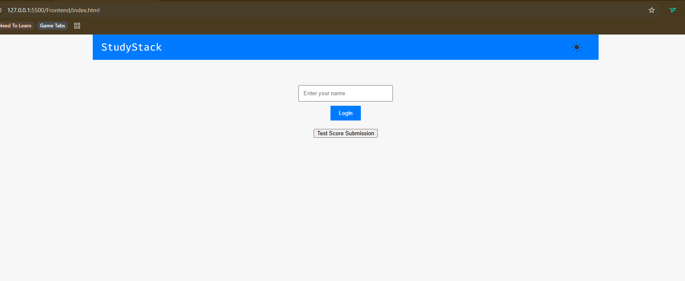

# Steps to Get This Project Working

1. **Change Directory to Frontend**

   - Run `npm i`

2. **Change Directory to Backend**

   - Run `npm i`
   - Run `npm run dev`

3. **Expected Terminal Output**

   - A `leaderboard.db` file should be created in the Backend directory.
   - You should see the following messages in the terminal:

   ```
   [nodemon] 3.1.7
   [nodemon] to restart at any time, enter `rs`
   [nodemon] watching path(s): *.*
   [nodemon] watching extensions: js,mjs,cjs,json
   [nodemon] starting `node backend/server.js server.js`
   Server running on port 3000
   Connected to SQLite database
   Leaderboard table ready
   Users table ready
   Decks table ready
   GET /api/scores
   Scores endpoint hit
   Sending top 5 scores: []
   ```

   - Backend endpoints
     - `http://localhost:3000/api/users/`
       - Will update properly with new users
     - `http://localhost:3000/api/users/:userId/decks`
       - although this only populates an empty array for now

4. If, by chance everything works then do the following - in the Frontend file directory, right click `index.html` and run Live Server. The following image should populate

   

   - If it doesn't, just alt+F4 and skip this project
   - If it does populate, go to step 5

5. Enter `Dustin` as the Username

## Functionality that works

- You can create decks and add flashcards with different points alloted.
- You can edit the Decks, but only able to edit the name of the deck, the category and add new flashcards.
- You can delete Decks and flashcards
- You can go through the flashcards and will either get a Correct/Incorrect response, and either gain points or not if the answer is right/wrong
- When you finish the deck, the score summary will calculate the points/percentage of correct answers
- you can click Test Score Submission to see the top scores adjust
- You can change themes from Light/Dark by clicking the Sun/Moon icon in the nav
- You can signout properly

## Functionality that breaks

- Decks created are not persistent on logout yet. Need to debug userId => deck association :disappointed:
- Score summary is not passed to `leaderboard.db` yet
- Some multiple fetch issues with the Frontend fetching the Backend randomly
- Also need to debug the settings theme toggle, doesn't want to work at the moment
- Need to hide the top scores container when in settings
